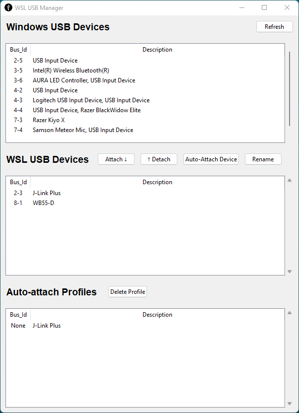

# wsl-usb-gui
This application provideds a gui to manage connecting USB devices from Windows to the WSL linux environment.

Behind the scenes it's simply a wrapper for the official command line tools to provide this functionality.
For more information, see:  https://devblogs.microsoft.com/commandline/connecting-usb-devices-to-wsl/

These command line tools are based on an open source project called USBIP which is a cross platform solution for sharing USB devices over any network connection.
It's uses server software running on the OS where USB devices are directly connected (in this case windows), then a matching client software running on the OS where the USB devices are to be used (wsl/linux).

## Installation

The latest installer is always available on [the releases page](https://gitlab.com/alelec/wsl-usb-gui/-/releases).

The installation of dependencies should be handled automatically at the end of the MSI installer. 

If any error occur here though, or the program doesn't appear to run correctly, a log of the install process can be viewed by hitting `Win`-`R` on the keyboard and copy/paste in: `notepad %APPDATA%\..\local\wsl-usb-gui\install.log`  
Alternatively, it may help to run through the dependency install steps manually as described below. 

### Manual dependency installation

Check the usbipd-win instructions for any updates: https://github.com/dorssel/usbipd-win/wiki/WSL-support

As of usbipd-win version 2.2.0 (at the time of writing) the following instructions should get you up and running.

USB in WSL requires WSL2 to be used, so if you've already installed `Ubuntu` on your Windows 10/11 installation, check it's version 2. From cmd/powershell:
``` cmd
C:\> wsl --list -v
  NAME                   STATE           VERSION
* Ubuntu                 Running         2
```

Then check the WSL2 kernel is up to date, version 5.10.60.1 or later is needed to support the underlying modules needed for usbip.
From Ubuntu/bash:
```
me@PC:~$ uname -a
Linux PC 5.10.102.1-microsoft-standard-WSL2 #1 SMP Wed Mar 2 00:30:59 UTC 2022 x86_64 x86_64 x86_64 GNU/Linux
```
In my case I'm on 5.10.102.1 which is good to go. 

If you're older than 5.10.60.1 then this can be updated from cmd/powershell:
``` cmd
wsl --shutdown
wsl --update
```

Once your WSL is on the current kernel, there are a couple of usbip tools to install from Ubuntu/bash;
``` bash
sudo apt install linux-tools-5.4.0-77-generic hwdata
sudo update-alternatives --install /usr/local/bin/usbip usbip /usr/lib/linux-tools/*/usbip 20
```

Then download and install the latest usbip server for Windows :
https://github.com/dorssel/usbipd-win/releases

Or it can be installed directly from powershell:
``` powershell
winget install --interactive --exact dorssel.usbipd-win
```

Note: If you are using a third-party firewall, you may have to reconfigure it to allow incoming connections on TCP port 3240.

At this point you should probably reboot your computer, then you can use this tool to manage your USB devices.


## Screenshot



## Credits
All the hard work to get USB devices working in WSL is thanks to USBIP and in particular usbipd-win : https://github.com/dorssel/usbipd-win

The WSL USB installer bundles a copy of usbipd-win from https://github.com/dorssel/usbipd-win/releases  
See [Drivers/README](https://github.com/dorssel/usbipd-win/blob/master/Drivers/README.md) and [COPYING](https://github.com/dorssel/usbipd-win/blob/master/COPYING.md) for associated licences.

This gui tool was inspired by https://github.com/K-Francis-H/usbip-gui and originally based on this codebase.
